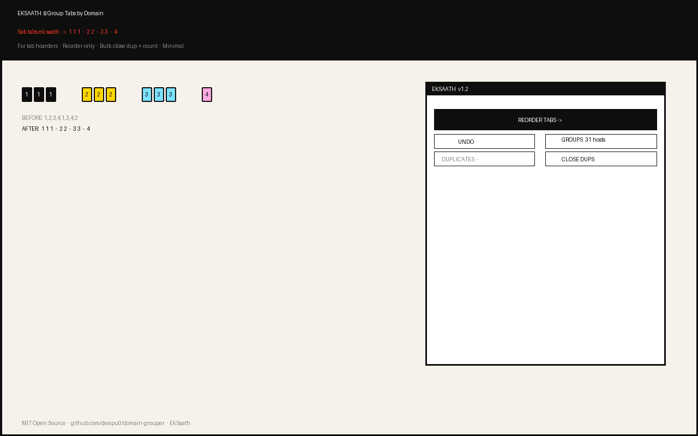
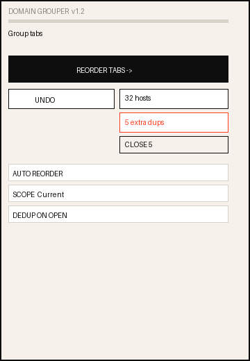
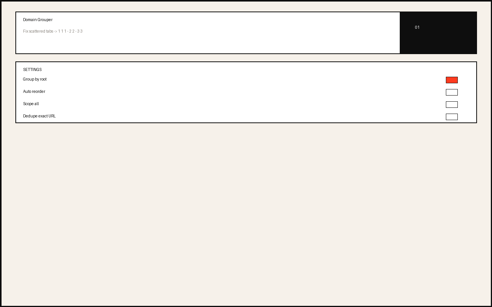

# Domain Grouper — Group Tabs by Domain

 

Fix scattered tabs. `1,2,3,4,1,3,4,2` → `1·1·1 — 2·2 — 3·3 — 4`

> **Why I built this**
>
> I keep 50+ tabs open. Always. I don't close them — I have affection for tabs, I might need them later. I know it's a habit, many of us do it.
>
> The problem: I open the same URL again without realizing. 4 copies of the same docs page, scattered across the bar. Not a huge problem, but every day I felt the clutter.
>
> I just wanted them **together**. If I can see — "okay, I already have 4 tabs for this thing" — I won't open a fifth. Small use case, but I faced it daily. If you hoard tabs too, give it a try.

## Features

- **Reorder by root domain** — one click groups same host. Alphabetical, stable. `mail.google.com` = `google.com`
- **See duplicates** — live count in popup: `2 groups · 5 extra`
- **Bulk close duplicates** — `CLOSE 5` keeps oldest, + bulk undo 30s
- **Prevent future dups** — optional exact-URL dedupe on open, 10s undo
- **Respects your tabs** — never touches pinned, `chrome://newtab`, `localhost`, custom whitelist
- **Minimal UI** — basic always, advanced collapsible. Shortcut `Alt+Shift+R`

 

## Install

**Dev:** `chrome://extensions` → Developer mode → Load unpacked → select this folder

**Store:** Upload `Domain-Grouper-v1.2.0.zip` to [Chrome Web Store Console](https://chrome.google.com/webstore/devconsole)

## Privacy

No data leaves device. Only `tabs` + `storage`. See [PRIVACY.md](PRIVACY.md)

## Changelog

See [CHANGELOG.md](CHANGELOG.md)

## License

MIT — see [LICENSE](LICENSE)

---
*For tab hoarders, by one.*
