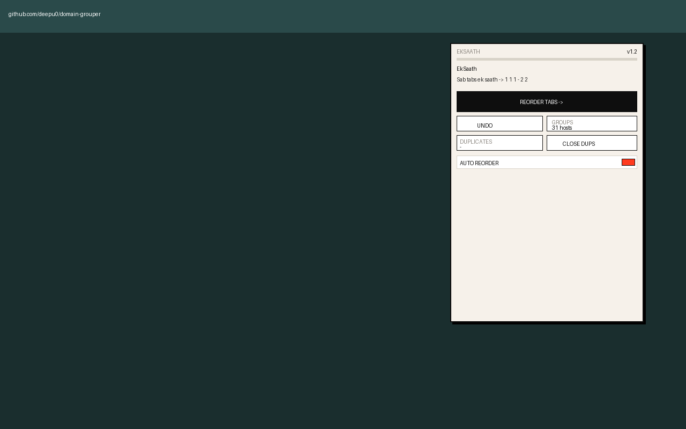
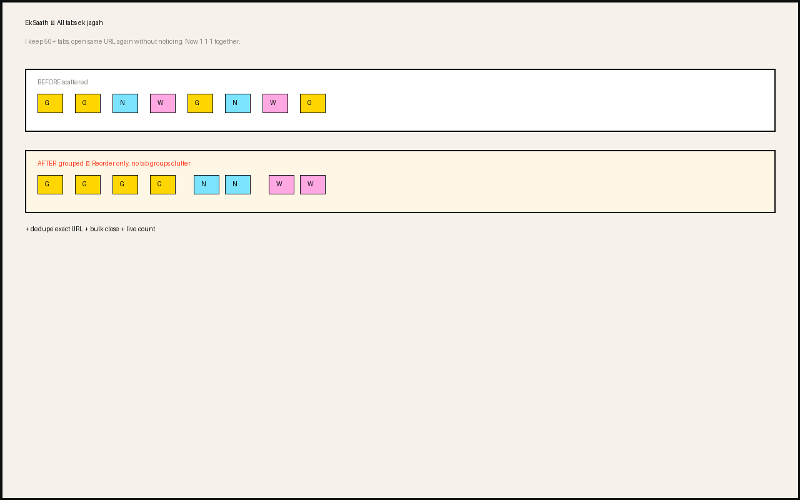

# EkSaath — Group Tabs by Domain

  

Stop hunting tabs. Same domain together, duplicates shown, extras closed in one click.

`1,2,3,4,1,3,4,2` → `1·1·1 — 2·2 — 3·3 — 4` — sab ek saath.

> **Why I built this**
>
> I keep 50+ tabs open. I don't close them — I have affection for tabs, I might need them later. Many of us do.
>
> The problem: I open the same URL again without realizing. 4 copies of the same docs page, scattered. Now with EkSaath, same domain sits together. I see — "I already have 4 tabs for this" — so I don't open a fifth.

## Screenshots (Chrome DevTools)

| Popup (real Chrome) | Before → After |
|---|---|
|  |  |

Minimal, industrial UI. Reorder only — no tab groups clutter.

## Features

- **Reorder by root domain** — alphabetical, stable. `mail.google.com` = `google.com`
- **Dedupe on open** — exact URL, close new → focus old, 10s undo
- **Bulk close duplicates** — `CLOSE 5` keeps oldest, live count `2 groups · 5 extra`, undo 30s
- **Never dedupe:** pinned, `chrome://newtab`, `localhost`, whitelist
- **Minimal UI:** basic always, advanced collapsible. `Alt+Shift+R`

## Install

**Dev:** `chrome://extensions` → Developer mode → Load unpacked → select this folder

**Store:** [Install from the Chrome Web Store](https://chromewebstore.google.com/detail/eksaath-%E2%80%94-group-tabs-by-d/dmbddhflionebnjhlopafpggcegkkklo) — live since Sep 2026 (3 users, 5.0/5 as of Sep 19, 2026)

## Privacy

No data leaves device. Only `tabs` + `storage`. See [PRIVACY.md](PRIVACY.md)

## Changelog

See [CHANGELOG.md](CHANGELOG.md)

## License

MIT — see [LICENSE](LICENSE)

---
*For tab hoarders, by one. Ek saath lao.*
