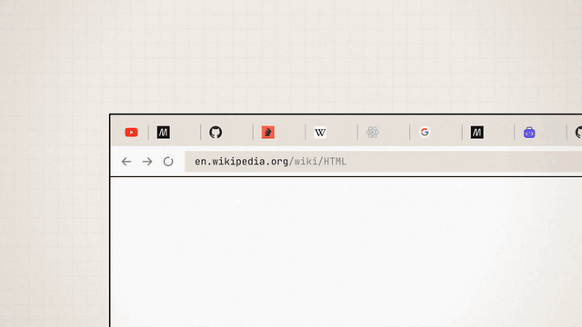
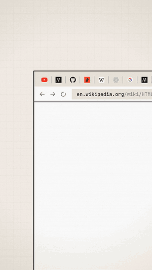

# EkSaath launch film

32 s · 60 fps · 105 BPM (56 beats) · 10-subframe motion blur · original score.

| Landscape 1920×1080 | Vertical 1080×1920 |
|---|---|
| [](eksaath-launch-1920x1080.mp4) | [](eksaath-launch-1080x1920.mp4) |

Click a GIF to open the MP4 (with sound). Posters: [`poster-1920x1080.jpg`](poster-1920x1080.jpg), [`poster-1080x1920.jpg`](poster-1080x1920.jpg).

## What's real

- **The extension.** The unpacked extension ran in headless Chromium with 23 real tabs (GitHub, Google, Stack Overflow, MDN, YouTube, Wikipedia, React, OnlyFrontendJobs). Every action was a real click on a popup button. The extension's own background script moved and closed the tabs. The recorded results are in [`source/meta.json`](source/meta.json).
- **Tab positions.** The drawn tab strip uses the ids, titles, favicons and positions Chrome reported before and after each action. Examples: the 4th MDN copy, the reorder into 8 hosts, `CLOSE 6` (24 → 18 tabs, oldest copy kept), dedupe-on-open jumping to the existing `github.com/react/react` tab with the `dup` badge, and the pinned YouTube tab staying at index 0.
- **Popup.** These are real 3× screenshots of the popup in each state ("3 groups · 6 extra", "GROUPED ✓", "CLOSED 6 in 3 groups ✓", "↩ Undo bulk (6)").
- **Store header.** A crop of the real Chrome Web Store listing (icon + title).

## What's drawn, and harness changes

- **Browser frame and tab strip.** These are generic drawings. Headless Chromium can't film Chrome's real tab bar, so the frame does not imitate Chrome's UI.
- **`chrome.windows.getCurrent`.** In the harness it is pointed at the tab window. Headless Chromium has no focused window, and the popup is opened in its own `type:'popup'` window so it isn't one of the tabs being reordered. No other extension code is changed.
- **"Add to Chrome" button.** It renders disabled in headless Chromium, so it isn't shown. The end card's "Free on the Chrome Web Store" pill is our own graphic.
- **Claims.** The film makes no user-count or rating claims. It shows only features in v1.2.x.

## Sound

[`source/score.py`](source/score.py) synthesises everything from the same `timeline.json` as the picture. No samples or third-party audio are used. The parts are:

- synth tabla playing a keherwa theka: dha/ge/na/tin/ka, with pitch-bent bayan strokes
- tanpura drone
- Karplus-Strong "sitar" plucks
- bass and claps
- UI effects: clicks, key clacks, one pop per closed duplicate, badge blips, and a tabla roll on the regroup

## Rebuild

The scripts use absolute sandbox paths (skia-canvas, Playwright, ffmpeg). Adjust the paths at the top of each file.

```sh
node capture.mjs                   # real captures -> cap/ (tabs, popups @3x, favicons, store header)
node fontcheck.mjs                 # every glyph from bundled fonts, 0 network requests
python3 score.py                   # -> work/score.wav
node stills.js 13.6,20.4,30.2 s    # stills + contact sheet
node render.js 0 240 0             # one segment; run 8 in parallel (FMT=vertical for 9:16)
```

The store screenshots in [`../screenshots/store/`](../screenshots/store/) were cut from the landscape film: five at 1280×800, plus 440×280 and 1400×560 promo tiles.

Fonts: Fraunces, JetBrains Mono and Noto Sans Math, all SIL OFL 1.1.
